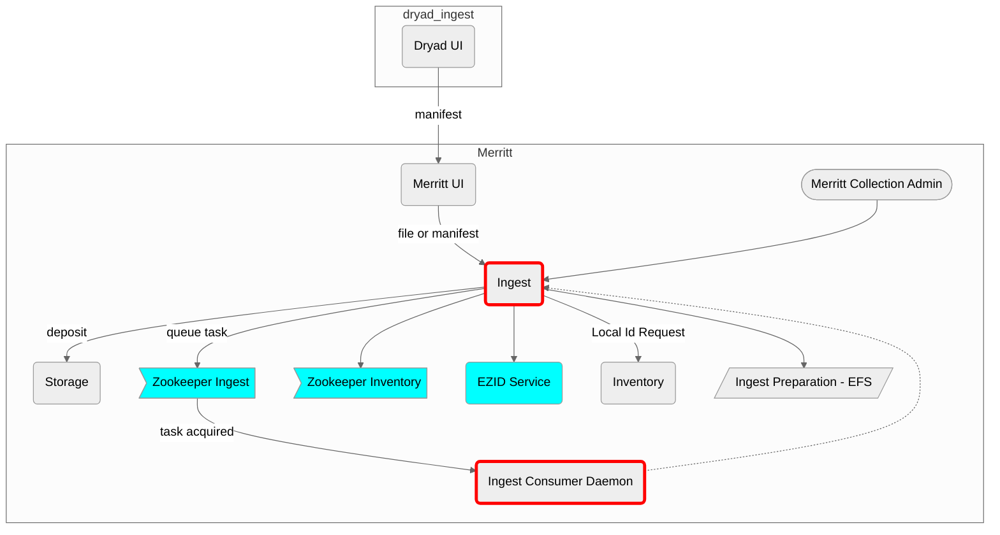

# Merritt Ingest Service

This microservice is part of the [Merritt Preservation System](https://github.com/CDLUC3/mrt-doc).

## Purpose

This microservice processes content to be ingested into the Merritt Preservation Repository.

An ingest package can consist of a single file, a container file (zip, tar), or a 
Merritt [manifest](https://github.com/CDLUC3/mrt-doc/wiki/Manifests) file.

Once an ingest package has been prepared, it is sent to the [Merritt Storage Service](https://github.com/CDLUC3/mrt-store).

## Original System Specifications
- [Merritt Ingest Service](https://github.com/CDLUC3/mrt-doc/blob/main/doc/Merritt-ingest-service-latest.pdf)

## Component Diagram




## Dependencies

This code depends on the following Merritt Libraries.
- [Merritt Core Library](https://github.com/CDLUC3/mrt-core2)
- [CDL Zookeeper Library](https://github.com/CDLUC3/cdl-zk-queue)

## For external audiences
This code is not intended to be run apart from the Merritt Preservation System.

See [Merritt Docker](https://github.com/CDLUC3/merritt-docker) for a description of how to build a test instnce of Merritt.

## Build instructions
This code is deployed as a war file. The war file is built on a Jenkins server.

## Test instructions

## Internal Links

### Deployment and Operations at CDL

https://github.com/CDLUC3/mrt-doc-private/blob/main/uc3-mrt-ingest.md

## Legacy README

### Architecture overview
Distribution package contains a war file which defines two servlets, poster and ingest.  

poster handles "batch" submissions, that is multiple objects per request.  Batches are defined in manifest (see Testing section)
Manifests are parsed and then queued in queueing service (Zookeeper).  A daemon process then polls queue and submits a "jobs" to the ingest service, which is housed in the ingest servlet.

If there is no need to process batches, then ingest service can be called directly.  Both ingest and poster support a REST and command line interface.


### Running under Tomcat
Unpack distribution and move ingest_home/ template directory to location defined in properties (see above).
Modify template directory to customize user environment.

```
Ingest home structure:
    profiles/		(user profiles)
    queue/		(ingest service working directory)


To allow ingest service to access data located in ingest home define a Context element in server.xml, for example
    <Context path="/ingestqueue" allowLinking="true" docBase="webapps/ingestqueue"/>

    Then create a symbolic link in the webapps directory, linking to ingest home queue directory.
	ln -s /dpr/ingest_home/queue ingestqueue
```

### Test
```
See online help pages for manifest information and sample data: http://merritt.cdlib.org/help

Example manifest submission using queue (synchronous):
    curl --silent  \
        -F "file=@example.checkm" \
        -F "type=container-batch-manifest" \
        -F "submitter=sample-user" \
        -F "responseForm=xml" \
        -F "profile=sample-profile" \
        http://example.org:8080/poster/submit
Example manifest submission directly to Ingest (synchronous):
    curl --silent  \
        -F "file=@example.checkm" \
        -F "type=container-batch-manifest" \
        -F "submitter=sample-user" \
        -F "responseForm=xml" \
        -F "profile=sample-profile" \
        http://example.org:8080/ingest/submit-object
```
### Logs
Check Tomcat logs.

